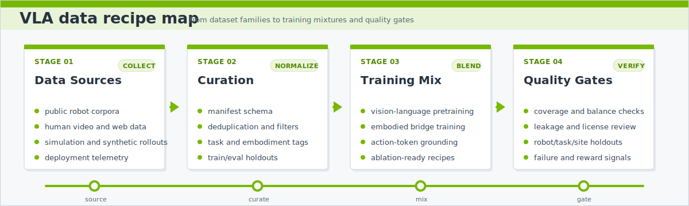

Welcome to VLA Training Recipes!
================================

This documentation is a research handbook for building and evaluating
vision-language-action (VLA) pretraining and mid-training data recipes. It is
organized like an engineering reference: start with the stage taxonomy, map the
dataset families, then use the recipe and quality-gate pages as checklists for
building a training corpus.

.. raw:: html

   

     

       

         Stage 01
         Pretraining data mixtures
       

       

         Stage 02
         Embodied mid-training bridges
       

       

         Stage 03
         Quality gates and holdouts
       

       

         Evidence
         Papers, surveys, and dataset sources
       

     

   

.. grid:: 1 1 2 3
   :gutter: 2
   :margin: 0
   :class-container: recipe-card-grid

   .. grid-item-card:: Training Stages
      :link: source/training_stages
      :link-type: doc

      Separate broad representation learning, embodied bridge training, and
      target-domain finetuning.

   .. grid-item-card:: Dataset Map
      :link: source/datasets
      :link-type: doc

      Track public robot corpora, in-domain logs, synthetic rollouts, human
      video, and reward telemetry as distinct dataset families.

   .. grid-item-card:: Recipe Source Map
      :link: source/recipes
      :link-type: doc

      Translate survey and model-paper evidence into practical corpus-building
      decisions.

   .. grid-item-card:: Quality Gates
      :link: source/quality
      :link-type: doc

      Define manifest columns, evaluation splits, metadata requirements, and
      data acceptance checks.

   .. grid-item-card:: References
      :link: source/references
      :link-type: doc

      Keep the cited VLA surveys, datasets, and model papers in one place.

   .. grid-item-card:: Build and Maintenance
      :link: source/build
      :link-type: doc

      Maintain the Sphinx build, GitHub Pages workflow, and public artifacts.

Table of Contents
=================

.. toctree::
   :maxdepth: 2
   :titlesonly:
   :caption: Research Guide

   source/overview
   source/training_stages
   source/datasets
   source/recipes
   source/quality
   source/references

.. toctree::
   :maxdepth: 1
   :titlesonly:
   :caption: Project

   source/build
